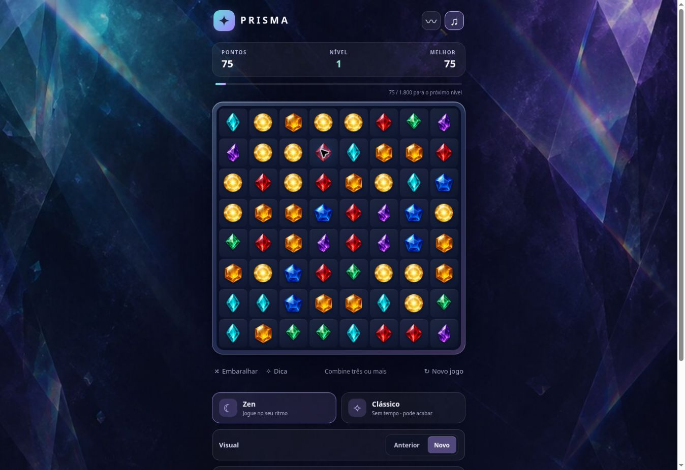

# Prisma

> Um jogo original de combinar pedras para jogar sem pressa.

[Jogar no navegador](https://prisma-jogo-thiago.thiagodluz.chatgpt.site) · [Repositório no GitHub](https://github.com/thiagodluz/Prisma)



Prisma é um jogo independente para Android e navegador, criado para quem gosta de combinar pedras, provocar cascatas e continuar jogando no próprio ritmo. Ele funciona sem internet depois de instalado, não exige conta e mantém as partidas no dispositivo.

## O que você encontra

- **Zen:** sem cronômetro e sem tela de derrota. Quando o tabuleiro fica sem jogadas, o jogo cria uma nova possibilidade e preserva seu progresso.
- **Clássico:** sem cronômetro, mas com desafio. A partida termina quando não restam jogadas possíveis.
- **Tabuleiro 8×8:** combine três ou mais pedras, provoque cascatas e avance por níveis.
- **Pedras especiais:** crie **Pulso**, **Raio** e **Espectro** para transformar uma boa jogada em uma reação em cadeia.
- **Experiência tranquila:** música e ambiente opcionais no Zen, efeitos ajustáveis, vibração opcional e suporte à preferência do sistema por menos movimento.
- **Offline e local:** o jogo não pede acesso à internet e salva partidas, recordes e preferências no armazenamento local do navegador ou do aplicativo.

Prisma tem identidade visual, áudio, interface e regras próprias. A inspiração vem do prazer dos jogos de combinar pedras, mas nenhum arquivo, som ou recurso de outro jogo foi incorporado ao projeto.

## Como jogar

Toque em duas pedras vizinhas ou arraste uma pedra para trocar de posição. A troca precisa formar uma linha horizontal ou vertical com três ou mais pedras da mesma cor.

- Quatro pedras criam um **Pulso**, que explode as oito casas ao redor.
- Uma formação em L ou T cria um **Raio**, que limpa a linha e a coluna.
- Cinco ou mais pedras em linha criam um **Espectro**, que pode limpar uma cor inteira.
- Combine especiais com cuidado: os efeitos podem atingir e ativar outras especiais.

Use **Dica** quando quiser encontrar uma jogada. No Zen, **Embaralhar** reorganiza o tabuleiro sem apagar pontos nem especiais.

## Jogar

### Navegador

Abra a [versão online](https://prisma-jogo-thiago.thiagodluz.chatgpt.site). Depois, você pode escolher **Adicionar à tela inicial** ou **Instalar app** para jogar como um aplicativo.

Para rodar localmente durante o desenvolvimento:

```bash
python3 -m http.server 8080
```

Em seguida, abra <http://localhost:8080>. O projeto precisa de um servidor local; abrir o HTML diretamente como `file://` pode impedir o carregamento dos módulos JavaScript.

Também existe uma versão autônoma em [Prisma-jogar-offline.html](Prisma-jogar-offline.html), útil em navegadores que permitem JavaScript em arquivos locais.

### Android

A versão atual é a **1.0.4**. O APK pode ser gerado pelo GitHub Actions ou compilado localmente. O aplicativo exige Android 8 ou mais recente e Android System WebView atualizada.

Os APKs de publicação são assinados com a mesma chave privada configurada nos segredos do repositório. Versões antigas instaladas a partir dos APKs de depuração têm outra assinatura: para instalar a primeira versão de publicação, será necessário desinstalá-las, o que apaga as partidas e preferências do aplicativo. O progresso da versão web fica separado.

O aplicativo não pede acesso à internet. Ele usa apenas a permissão opcional de vibração e guarda seus dados no armazenamento privado do próprio aplicativo.

## Compilar e testar

O projeto Android está em `android/`. Com JDK 17, Android SDK Platform 35, Build Tools 35.0.0 e Gradle 8.13:

```bash
gradle -p android :app:assembleDebug
```

O APK resultante fica em `android/app/build/outputs/apk/debug/app-debug.apk`.

Para executar os testes:

```bash
npm test
```

Para reconstruir o arquivo HTML autônomo depois de editar o projeto:

```bash
npm run build:offline
```

Antes de criar uma versão, atualize `version` em `package.json`, execute `npm run sync:version` para atualizar o `versionCode` Android e o cache dos arquivos do navegador, e reconstrua o HTML offline. A CI verifica `npm run check:version`, `npm run check:offline` e `npm run check:publish-version`: mudanças nos arquivos distribuídos exigem uma versão superior à última tag. Use versões finais ou `-beta.N` (N entre 1 e 98); versões sucessivas devem ter números maiores. A execução manual do workflow na `main` compila e publica o APK assinado após verificar sua assinatura; uma tag `v<versão>` também pode disparar esse processo. A configuração inicial dos segredos e a guarda da chave estão em [docs/publicacao-android.md](docs/publicacao-android.md).

O projeto não depende de bibliotecas externas em tempo de execução.

## Design e direção

A prioridade do Prisma é oferecer uma experiência legível, agradável e contínua em telas móveis. As sete pedras comuns têm silhuetas diferentes; as pedras especiais usam símbolos grandes o bastante para serem reconhecidas durante uma cascata; o fundo mantém o centro escuro para não competir com o tabuleiro.

A música do Zen e os efeitos são sintetizados pelo próprio código. Os assets, decisões visuais e pontos que ainda precisam de validação em aparelhos Android estão documentados em [docs/arte-e-audio.md](docs/arte-e-audio.md). As regras de jogo e as decisões de equilíbrio estão em [docs/regras-e-direcao.md](docs/regras-e-direcao.md).

## Licenças e autoria

© 2026 Thiago Luz.

- O código-fonte, incluindo o aplicativo Android, os testes e os scripts de compilação, está sob a [GNU GPL-3.0-only](LICENSE).
- As cinco imagens listadas em [LICENSE-ART.md](LICENSE-ART.md) estão sob [CC BY-SA 4.0](https://creativecommons.org/licenses/by-sa/4.0/legalcode).
- O nome **Prisma** e os ícones de identificação do aplicativo não fazem parte da licença da arte. Forks podem mencionar a origem, mas devem adotar identidade própria.
- Forks e versões derivadas devem preservar os créditos, indicar as alterações e manter as obrigações das licenças correspondentes.

Consulte os arquivos de licença para saber exatamente quais direitos se aplicam a cada parte do projeto.

## Estado do projeto

O Prisma é um projeto independente em desenvolvimento. A versão 1.0.2 está jogável, mas a experiência em aparelhos Android reais — especialmente consumo de bateria, retomada, áudio e leitura das pedras em telas pequenas — ainda deve ser validada antes de ser tratada como uma versão final de distribuição.

Sugestões, relatos de problemas e contribuições são bem-vindos. Ao abrir uma issue, informe o aparelho, a versão do Android, o modo de jogo e os passos para reproduzir o problema.
